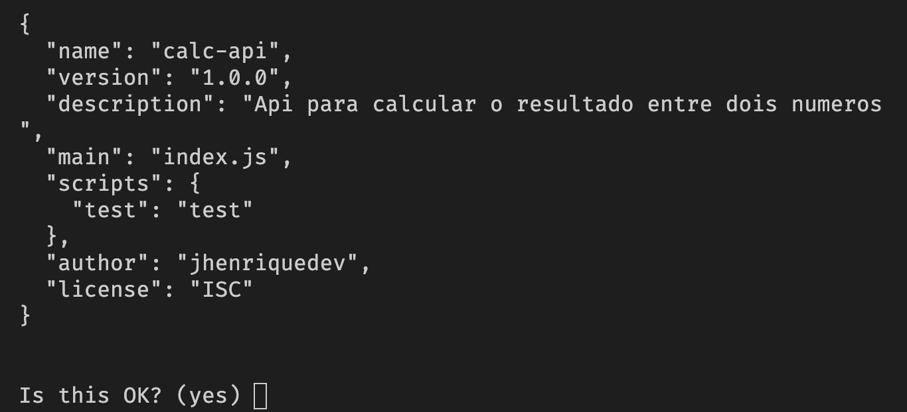

# API de Operações Matemáticas

  ## Aula 01 - Configuração do projeto

  1. Introdução ao projeto

  2. Iniciando o projeto
    Para inciarmos nosso projeto precisamos dar o comando para iniciar o npm, no terminal.
    Para isso vamos navegar até o diretorio do projeto digitando:
    ``` cd caminho do diretorio ```
    E dentro do diretorio raiz do projeto basta digitar: 
    ``` npm init ``` 
    Após informar este comando e dar enter, vai aparecer algumas perguntas para con figuração inicial do projeto, vamos ver cada uma das opções que o npm nos dá:
      - Em package name: (projeto), basta digitar um nome para o seu projeto. Aqui no meu vou batizar de calc-api
      - Em Version, pode apenas dar enter
      - Em description, você pode incluir uma pequena descrição que defina do que o seu projeto se trata.
        Ex: Api Para calculcar o resultado entre dois números.
      - Agora em entry point, é preciso observar por qual arquivo você gostaria que seu projeto inicie. Vou deixar em index.js mesmo e dar enter.
      - Em test command, você informa um nome para chamar o npm para a execução do script de teste da api, vou digitar test e dar enter.
      - Em git repository apenas dê enter
      - Em Keywords, você pode simplesmente deixar em branco ou digitar quais serão as palavras chaves do seu projeto, irei apenas ignorar isso por hora e dar enter para continuar
      - Em Author, você pode informar o seu nome e depois dê enter
      - Irei colocar meu nome do GitHub.
      - Em license apenas dê enter
      - Depois de completar todas essas irá aparecer uma pergunta de confirmação, basta dar enter.
      - Estando tudo certo, você verá algo como esse print da saida do terminal.
      

  3. Arquivo package.json
    Após a conclusão da configuração inicial do npm, vai surgir um arquivo json no diretorio raiz do nosso projeto chamado package.json.
    Ao abrirmos esse arquivo, vamos verificar que o conteúdo dentro dele, nada mais é do que algumas informações úteis ao npm, que realmente são as configurações do seu projeto.
    Perceba que os campos que preenchemos no terminal, estão todos aqui, porém ainda existem outros campos que podem surgir a medida que a gente avança no desenvolvimento do projeto.
    Nesse ponto, nosso projeto está sem dependencias, porém para realmente começarmos a trabalhar vamos precisar instalar algumas dependencias.
    No terminal digite: ``` npm install -d express ```, esse comando irá instalar para o projeto a biblioteca do express, que irá nos permitir criar um servidor no simples que será executado no node.
    OBS: O parametro -d indica que o pacote instalado será uma dependencia do projeto.
    Agora se você voltar os package.json novamente, poderá ver que foi adicionado mais uma categoria chamada ``` dependencies ```, conforme vemos a seguir: